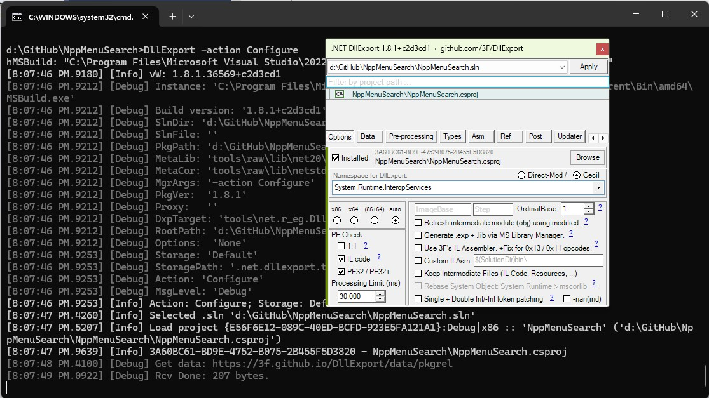

# [DllExport]

[DllExport] enables the export of C# functions as native entry points, allowing managed code to be consumed by unmanaged applications.  
Used as a replacement for old and unsupported *UnmanagedExports* and its forks.  

See [Readme.md] and [Wiki] for more details.

# [DllExport Manager]

See [Quick start] page for bootstrap instructions.
> [!NOTE]
> Set it up just once! you don't have to do this every time.

[DllExport.bat] will automatically add required changes to your selected project.

The changes include:
1. `PropertyGroup` with `DllExport*` properties.
1. `PackageReference` for `DllExport` package.
1. Import `net.r_eg.DllExport.targets`.
1. Define `DllExportRestorePkg` and `DllExportRPkgDynamicImport` targets.

Some basic commands:  
`DllExport -action Configure` - to redo project configuration.  
`DllExport -action Update` - to update an already configured version with a new package.  
`DllExport -action Upgrade` - force upgrading together with manager (**recommended** by default).  
`DllExport -action Restore` - to manually restore package (restored **automatically** during any build operation by *default).  

Setup example:  
  

[DllExport]: <https://github.com/3F/DllExport>
[Readme.md]: <https://github.com/3F/DllExport/blob/master/Readme.md>
[Wiki]: <https://github.com/3F/DllExport/wiki>
[DllExport Manager]: <https://github.com/3F/DllExport/wiki/DllExport-Manager>
[Quick start]: <https://github.com/3F/DllExport/wiki/Quick-start>
[DllExport.bat]: <https://3f.github.io/DllExport/releases/latest/manager/>

